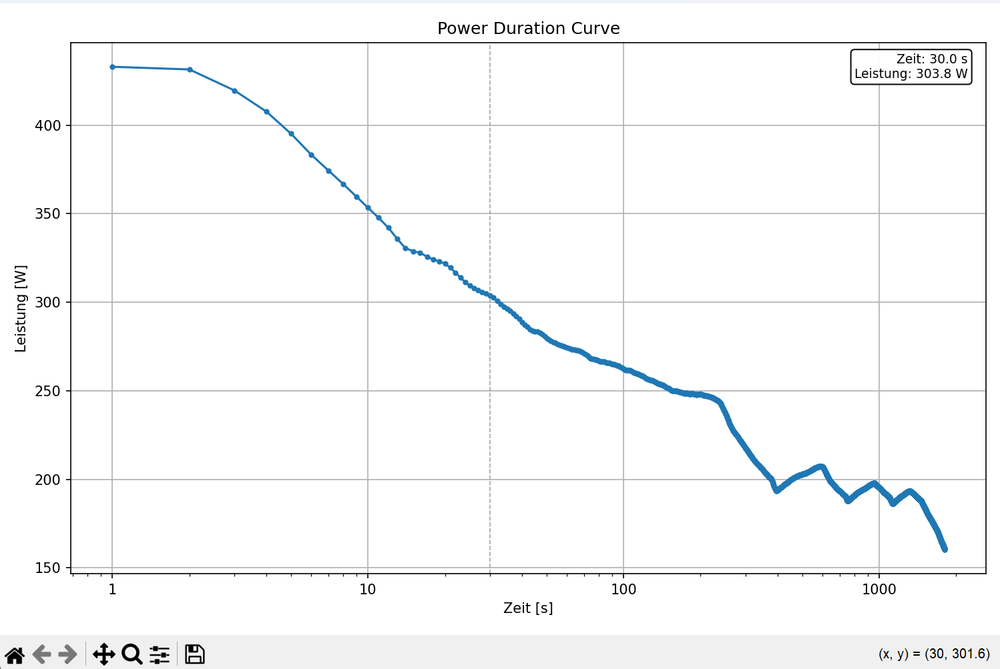

# Abgabe3

von Milan Buerkle und Joris Fabian 

# Beschreibung 

Dieses Projekt erstellt aus Leistungsdaten (Watt) eine Power Duration Curve.
Die Leistungskurve wird berechnet und anschließend als Diagramm dargestellt.

## Python-Umgebung

Dieses Projekt verwendet ein lokales virtuelles Umfeld in `.venv`.

### VS Code

1. Öffne den Ordner des Projektes in VS Code.
2. Die Python-Erweiterung sollte den Interpreter automatisch auf `.venv\Scripts\python.exe` setzen.
3. Falls nicht: Öffne die Kommando-Palette mit `Strg+Shift+P` und wähle `Python: Interpreter auswählen`.
4. Wähle dann den Eintrag mit `\.venv\Scripts\python.exe`.

### Projekt starten

-Wechsle in das Projektverzeichnis und starte das Hauptprogramm:

python main.py

- Oder direkt in VS Code: Starte `main.py` mit dem grünen Play-Button oder `F5`.

### Installierte Pakete

- pandas
- matplotlib
- numpy

## Visualisierung

Die Grafik zeigt die Power Duration Curve, die von `main.py` erzeugt wird.
